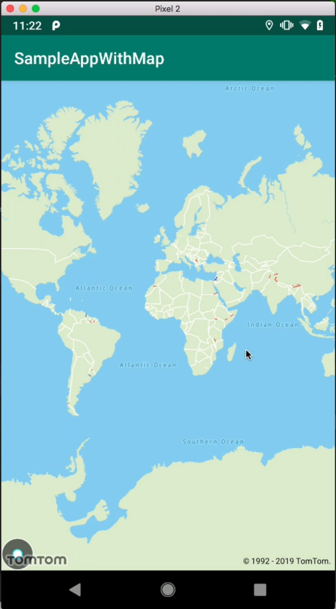

# This tutorial shows how to use TomTom Maps SDK for Android and create an working application in less than 30 minutes

## In this course you will learn:

* How to start your journey with TomTom Map SDK
* Write a simple Android Main Activity
* Connect with TomTom Web Services using TomTom developer portal

## Build the next generation of location experiences

In order to get a fully functional application you need to obtain a free API key by completing the registration on TomTom Developer Portal.

**WARNING:** Keep in mind that the API key is personal and can't be shared nor pushed to the public repository. By doing that you would violate terms and conditions.

## Example App

At the end of a day, you will create an Android app which will look like this:

## Requirements

* [Android Studio](https://developer.android.com/studio)

## Credits

This repository was created using [Cookiecutter](https://github.com/cookiecutter/cookiecutter) and the [tomtom-international/cookiecutter-android](https://github.com/tomtom-international/cookiecutter-android) project template.

Special thanks to all [contributors](https://github.com/tomtom-international-labs/maps-sdk-android-display-a-map/blob/master/CONTRIBUTORS.md).
